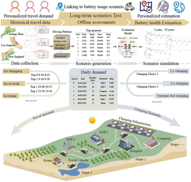
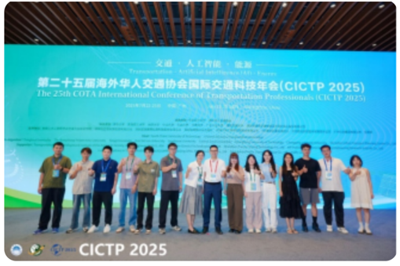
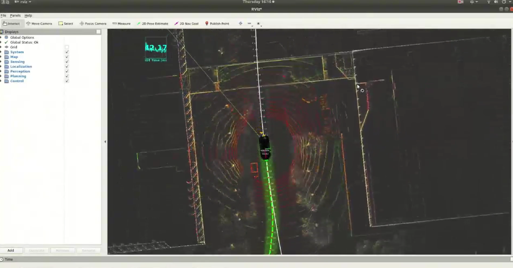
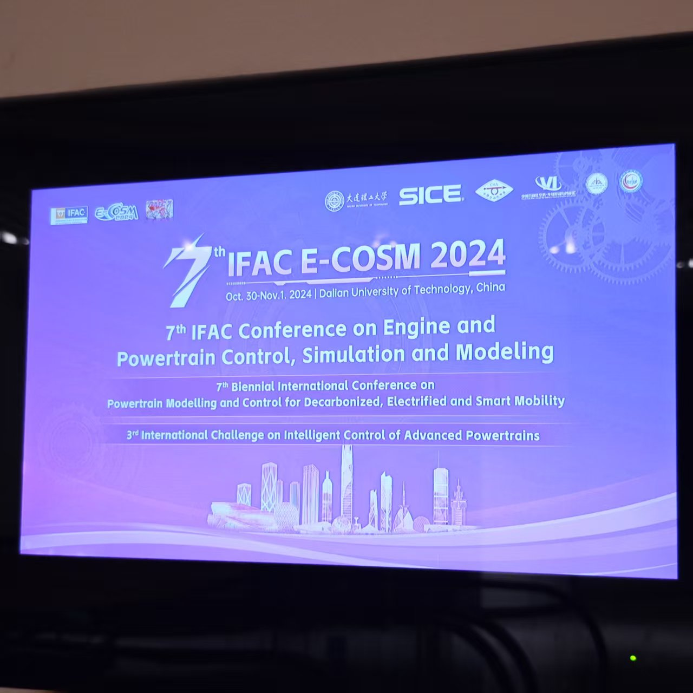
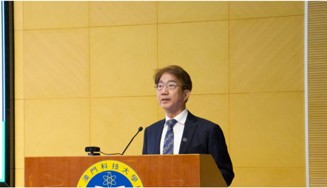
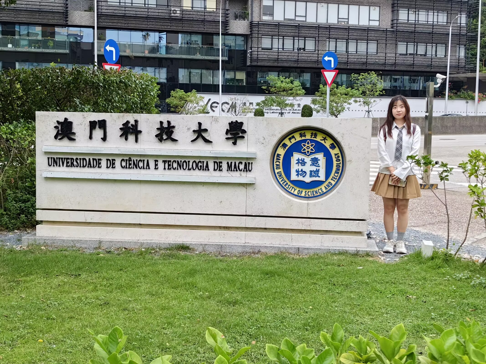
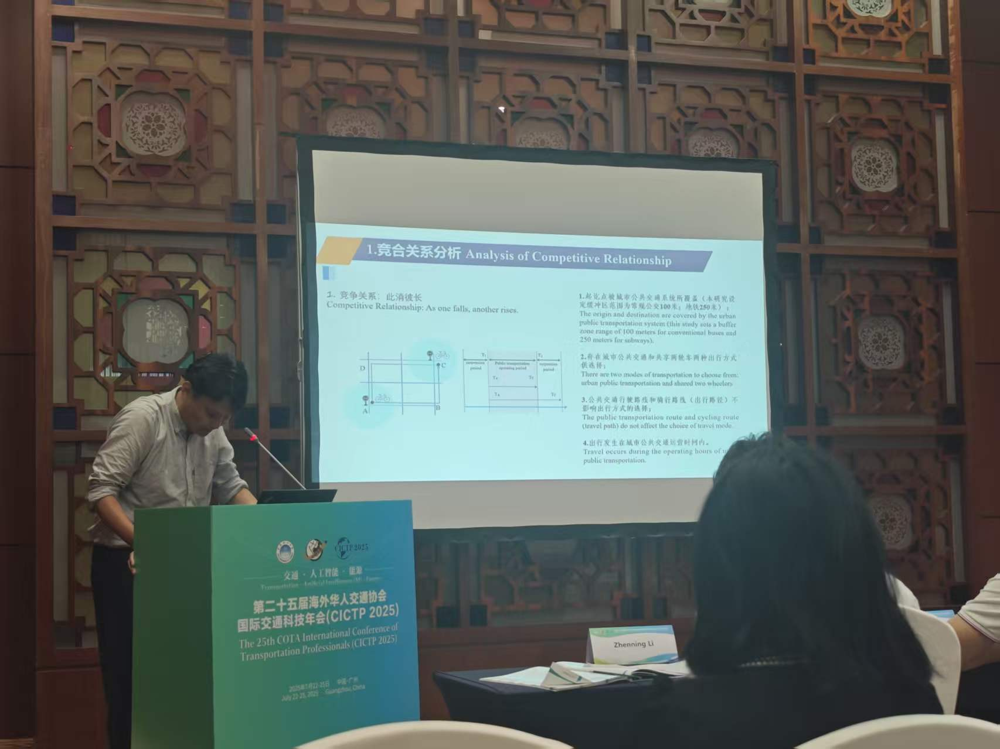

  

  

## About Me

Hi, I'm **Yu Dong**.  
I received my Bachelor's degree from Yancheng Teachers University (Jiangsu, China), majoring in Broadcasting and Television Studies (GPA: 3.47/4.0).

My academic interests focus on **cognitive neuroscience technologies** and **clinical counseling**.  
I aspire to pursue doctoral studies or become a professional psychological counselor.

<b>中文版个人简介 (Click to expand)</b>

你好！我是 **董宇**，本科就读于江苏省盐城师范学院，专业为m广播电视学，GPA：3.47/4。  
研究兴趣：认知神经技术与临床咨询。  
发展方向：读博深造或成为心理咨询师。  
已取得：雅思 6.0（口语、写作均 6.0）、普通话证书、教师资格证。

---

## Key Experiences

### 🧠 Research Skills

#### 1. Academic Reading & Writing
- Literature review and academic writing  
- IELTS Overall Band Score: 6.0  

#### 2. Scientific Visualization & Research Design
- Proficient in Adobe Illustrator, Photoshop, PowerPoint, and Visio  
- Experience in designing academic figures and research diagrams  

**Representative Publication Contribution:**

<table>
<tr>
<td width="35%" valign="top">

</td>

<td width="65%" valign="top">

<strong>Qi H, Ou S S, Jia Y H, et al.</strong> 
<em>A Cross-Temporal Framework for Driving Behavior Impact on Electric Vehicle Battery Health</em> 
Communications in Transportation Research, 2026.  

Impact Factor: 14.5 
SSCI & SCIE indexed 
Selected for the China Excellent Science and Technology Journals Action Plan  

Contribution: Scientific visualization and academic figure design.

</td>
</tr>
</table>

#### 3. Programming & Technical Skills
- Python  
- PyCharm  
- PyTorch  

Reproduced an open-source PyTorch image classification project:  
https://github.com/fendouai/PyTorchDocs

---

### 🎯 Academic Outreach & Communication

- Video production for research group promotion  
- Management and content creation for the research group’s public media account  

<table>
<tr>
<td width="50%" align="center">

</td>

<td width="50%" align="center">

</td>
</tr>
</table>

---

### 🏆 Honors & Certifications

<b>Full Awards List</b>

 

<small>

- September 2022 – National Second Prize, 14th National College Advertising Art Competition (Award Ceremony at the Great Hall of the People, Beijing)

- June 2022 – National First Prize, 13th Lanqiao Cup National Visual Design Competition

- June 2022 – National Second Prize, 13th Lanqiao Cup National Visual Design Competition

- June 2021 – National Third Prize, 12th Lanqiao Cup National Visual Design Competition

- June 2022 – National Excellence Award, 13th Lanqiao Cup National Visual Design Competition

- June 2022 – Provincial Second Prize, 14th National College Advertising Art Competition

- June 2021 – Provincial Third Prize, NCDA Future Designer National Art & Design Competition

- February 2022 – Second Prize (Animation Category), “Encounter the Most Beautiful Yancheng” Youth Creative Design Competition, Jiangsu Province

- June 2021 – University-Level Second Prize, National College Advertising Art Competition

- June 2021 – University-Level Third Prize, NCDA Future Designer National Art & Design Competition

- December 2020 – University-Level Third Prize, China College Advertising Art Festival Academy Award

- November 2020 – First Prize, Creative Video Skills Competition, School of Literature

- December 2020 – Outstanding Contributor Certificate, National College Advertising Art Competition Selection Round

- April 2021 – Excellence Award, National College Environmental Protection Knowledge Competition

</small>

---

### 📌 Work Experience

- 08/2024 – 03/2025 | IELTS Teaching Assistant, Guangzhou Xinhangdao  
- 07/2023 – 03/2024 | Short Video Operations, Beijing Jiuyi Media  
- 08/2022 – 11/2022 | Planning Intern, Alibaba Pictures (MCN Division)  
- 06/2020 – 09/2020 | Teaching Assistant, Chengdu Puxin Education  

---

### ⭐ Academic Engagement

- Actively participated in academic seminars and scholarly activities  

 

<table>
<tr>

<td align="center" width="25%">

 
Dalian · IFAC
</td>

<td align="center" width="25%">

 
Macau · Conference
</td>

<td align="center" width="25%">

 
Macau · Meeting
</td>

<td align="center" width="25%">

 
Guangzhou · Forum
</td>

</tr>
</table>

## 📸 Featured Projects
> Check out my [GitHub Repositories](https://github.com/lain-ego0?tab=repositories) for full source code and detailed documentation.

- **[BRS Parallel Quadruped Robot](https://github.com/lain-ego0/ROBOCON-BRS_robot)** - Full-stack open-source project of a parallel-structure quadruped robot, including mechanical design, embedded control system, and motion planning algorithms. Applied in 2025 ROBOCON National Competition. `ROS2` `C++` `Mechanical Design` `Open Source`

- **[HTDW4438 Isaac Gym RL Training Framework](https://github.com/lain-ego0/HTDW4438_Isaacgym)** - Reinforcement learning simulation training environment for quadruped robots, modified based on legged_gym, with completed sim2sim migration and locomotion policy training. `Python` `PyTorch` `Isaac Gym` `Reinforcement Learning` `Legged Locomotion`
---

<h3> 🤝🏻 &nbsp;Connect with Me </h3>

  &nbsp;
  &nbsp;
  &nbsp;
  &nbsp;
  &nbsp;

  
  
  

  

---

 
  "Constantly exploring the intersection of mechanics, electronics, and AI to build more capable robots!" 🤖

